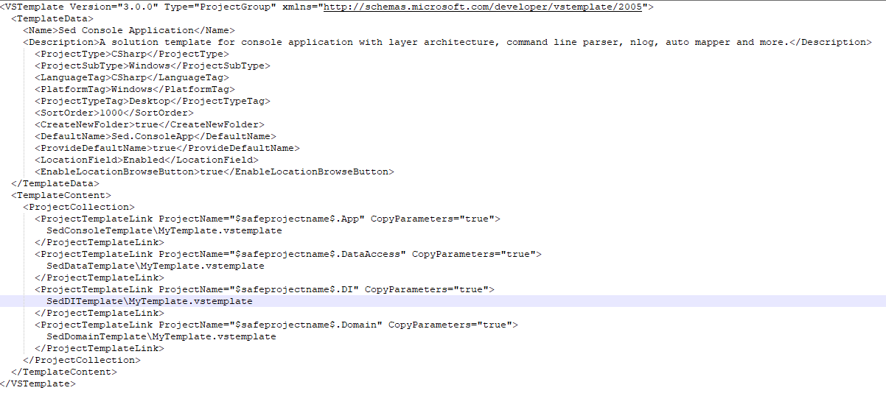

# DotNetConsoleAppTemplate
Visual Studio multi project template for a .NET console application

# Multi-Project Template Creation

1. Create the solution, projects and project references as normal
2. Export each project as template (do not automatically import them to VS)

3. Unzip the export files, you can delete the zip files

4. Open the .csproj files of your exports and adjust the project references to take the selected name into account

5. Create a new .vstemplate file in the root and configure the parameters to be usable in your .csproj files (CopyParameters="true")

6. Create one zip file of your unzipped project exports from step 3 and the newly created .vstemplate file from step 5

7. Copy the zip file into the "ProjectTemplates" folder from VS (/documents/Visual Studio 2022/Templates/ProjectTemplates)

8. Open VS and the template should be shown